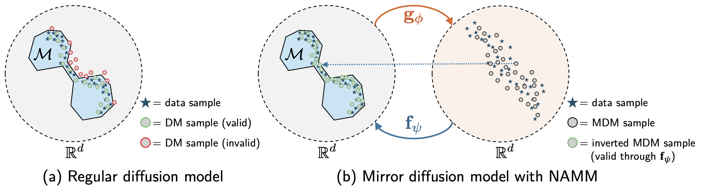
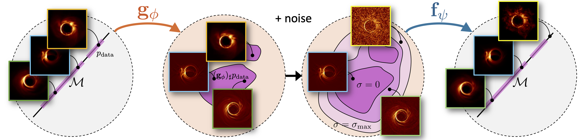
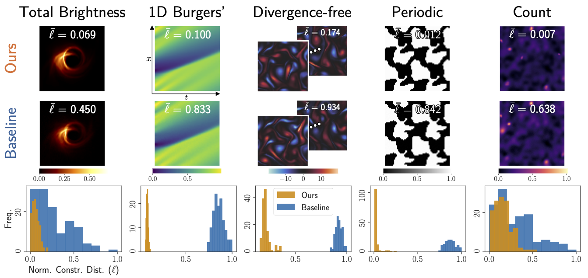
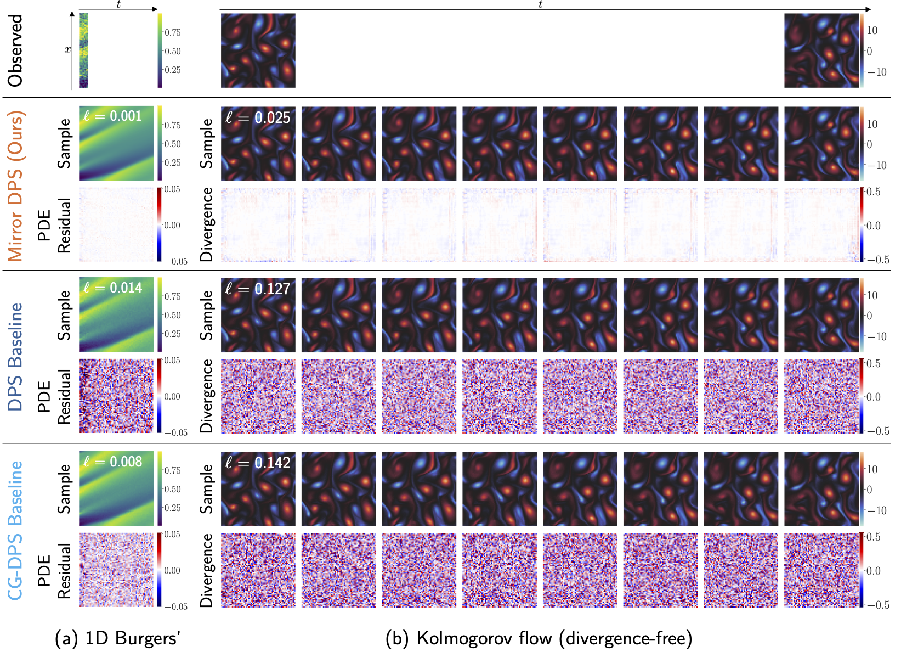

# Neural Approximate Mirror Maps for Constrained Diffusion Models

<p align="center">
  
</p>

In ["Neural Approximate Mirror Maps for Constrained Diffusion Models"](https://openreview.net/forum?id=vgZDcUetWS) (ICLR 2025), we propose a way to flexibly impose constraints on generative models by construction. We train two networks to approximate a forward mirror map and inverse mirror map, where the forward mirror map transforms constrained data into an unconstrained space, and the inverse mirror map restores arbitrary samples to the constrained space. Once these networks are trained, we can train a generative model (e.g., diffusion model) in the learned mirror space and constrain its samples via the learned inverse mirror map.

Please consider citing this work if you find it useful:
```
@inproceedings{
  feng2025neural,
  title={Neural Approximate Mirror Maps for Constrained Diffusion Models},
  author={Berthy Feng and Ricardo Baptista and Katherine Bouman},
  booktitle={The Thirteenth International Conference on Learning Representations},
  year={2025},
  url={https://openreview.net/forum?id=vgZDcUetWS}
}
```

## Environment
Run the following commands to set up the Conda environment. The code was most recently tested with JAX v0.5.0 for CUDA 12.
```
conda create -n namm python=3.10
conda activate namm
pip install "jax[cuda12]"
pip install tensorflow
pip install tensorflow_datasets
pip install tf_keras
pip install tensorflow_probability
pip install jax_cfd
pip install flax
pip install diffrax
pip install ml_collections
pip install jupyterlab
pip install matplotlib
pip install seaborn
```

Install additional packages for `write_data.py`:
```
pip install scikit-learn
pip install astropy
```

## Pipeline
The general pipeline is as follows:
1. Generate dataset
2. Train NAMM
3. Train diffusion model in mirror space (MDM)

Here we provide commands for the 1D Burgers' constraint, but they can be easily adapted for the other constraints demonstrated in the paper (i.e., Divergence-free, Total Brightness, Periodic, and Count) by changing the `dataset` and `constraint` arguments. You can also add your own constraint distance function to `get_constraint_losses_fn` in `losses.py` and add a corresponding dataset in `score_flow/datasets.py`.

### 1. Generate dataset
Generate data using the provided `write_data.py` script. The following datasets are supported, corresponding to the demonstrated constraints in the paper: `riaf`, `burgers`, `kolmogorov`, `periodic`, and `galaxies`. Note: the RIAF dataset replaces the proprietary GRMHD dataset that's in the paper.

To generate a dataset for the 1D Burgers' constraint, run the following:
```
python write_data.py \
  --dataset burgers \
  --outdir data \
  --n_train 10000 \
  --n_test 1000 \
  --n_val 1000 \
  --filetype tfrecord \
  --n_per_shard 1000
```

### 2. Train NAMM
During training, the forward mirror map $\mathbf{g}_\phi$ maps training images into a "mirror" space. We perturb these mirror images with additive white Gaussian noise of varying noise levels to create training data for the inverse mirror map $\mathbf{f}_\psi$. The inverse mirror map attempts to map these noisy mirror images back to the original space. Both maps are trained jointly to minimize the following objective:
$$
\mathcal{L}(\phi,\psi):=\mathcal{L}_{\text{cycle}}(\mathbf{g}_\phi,\mathbf{f}_\psi)+\lambda_{\text{constr}}\mathcal{L}_{\text{constr}}(\mathbf{g}_\phi,\mathbf{f}_\psi)+\lambda_{\text{reg}}\mathcal{R}(\mathbf{g}_\phi).
$$
An illustration of the training procedure is shown below:
<p align="center">
  
</p>

Continuing with our Burgers' example, run the following command to train a NAMM on the 1D Burgers' constraint:
```
python train_namm.py \
    --config configs/namm_config.py \
    --workdir $PWD/checkpoints \
    --config.data.dataset Burgers \
    --config.data.height 64 \
    --config.data.width 64 \
    --config.optim.constraint_weight 1. \
    --config.optim.max_sigma 0.1 \
    --config.optim.regularization sparse_icnn \
    --config.training.n_epochs 100 \
    --config.constraint.type burgers \
    --config.model.fwd_network icnn \
    --config.model.bwd_residual
```

### 3. Train MDM
Once the NAMM is trained, we train a diffusion model in the learned mirror space. For the 1D Burgers' constraint, run:
```
python train_mdm.py \
    --namm_config configs/namm_config.py \
    --score_config configs/score_config.py \
    --workdir $PWD/checkpoints/Burgers_burgers/sparseicnn_cyc=1.0_reg=0.001_constr=1.0_maxsig=0.1_lr=2e-04_bs=16_layers=3_fwdnfilt=32_bwdnfilt=64 \
    --score_config.data.dataset Burgers \
    --score_config.data.height 64 \
    --score_config.data.width 64 \
    --score_config.training.n_epochs 300 \
    --score_config.training.log_freq 100 \
    --namm_config.constraint.type burgers \
    --namm_config.model.fwd_network icnn \
    --namm_config.model.bwd_residual
```

## Finetuning (Optional)
Optionally, we can finetune the NAMM to what the MDM has learned.

First, we generate a finetuning dataset of samples from the trained MDM:
```
python gen_mdm_data.py \
    --config configs/score_config.py \
    --workdir $PWD/checkpoints/Burgers_burgers/sparseicnn_cyc=1.0_reg=0.001_constr=1.0_maxsig=0.1_lr=2e-04_bs=16_layers=3_fwdnfilt=32_bwdnfilt=64 \
    --mdm_ckpt 300 \
    --constraint burgers \
    --dataset_name burgers_mdm
```

Then we finetune the NAMM on this dataset:
```
python train_namm.py \
    --config configs/namm_config.py \
    --workdir $PWD/checkpoints \
    --config.data.dataset Burgers \
    --config.data.height 64 \
    --config.data.width 64 \
    --config.optim.constraint_weight 1. \
    --config.optim.max_sigma 0.1 \
    --config.optim.regularization sparse_icnn \
    --config.training.n_epochs 700 \
    --config.training.snapshot_epoch_freq 50 \
    --config.constraint.type burgers \
    --config.model.fwd_network icnn \
    --config.model.bwd_residual \
    --finetune \
    --constraint_weight 1. \
    --max_sigma 0.1 \
    --mdm_dataset burgers_mdm
```

## Train Vanilla DM
We provide a training script for a vanilla diffusion model. For the 1D Burgers' dataset, run:
```
python train_dm.py \
    --config configs/score_config.py \
    --namm_config configs/namm_config.py \
    --workdir $PWD/score_checkpoints \
    --config.data.dataset Burgers \
    --config.data.height 64 \
    --config.data.width 64 \
    --config.data.num_channels 1 \
    --config.training.batch_size 64 \
    --config.training.n_epochs 1500 \
    --namm_config.constraint.type burgers
```

## Evaluation with Checkpoints
Download pretrained NAMM, MDM, and DM checkpoints for all the demonstrated constraints here: https://caltech.box.com/v/nammcheckpoints. The NAMM and MDM checkpoints will go under `./checkpoints`, and the DM checkpoints will go under `./score_checkpoints`. Note that these checkpoints were created with an older version of JAX/Flax (v0.4.11) and saved with legacy Flax checkpointing.

We provide the following notebooks to demonstrate how to use pretrained checkpoints. They support both legacy Flax and Orbax checkpointing.
1. `notebooks/eval.ipynb` shows how to generate samples from an MDM and restore them to the constrained space with the learned inverse mirror map. It includes comparisons to a vanilla DM. It can be used to generate results similar to the ones shown in this figure:
<p align="center">
  
</p>

2. `notebooks/data_assimilation_burgers.ipynb` demonstrates data assimilation for a 1D Burgers' system with the 1D Burgers' PDE constraint.
3. `notebooks/data_assimilation_incompress.ipynb` demonstrates data assimilation for a Kolmogorov flow with a divergence-free constraint. The data assimilation notebooks show how to generate results like the ones in this figure:
<p align="center">
  
</p>